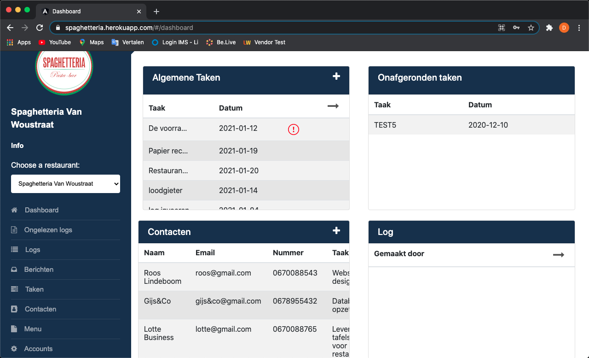

We describe our product as follows, on our website we use two different kinds of accounts: top management and branch. Top management is able to see and interact with all the data that is saved for every restaurant. They can add or deactivate (soft delete) branch accounts. They are also able to add, update or delete all the data from contacts, dishes, drinks and tasks. 

They are also able to verify the tasks before they are officially marked as done. We implemented this so that when a task has been selected as done by a branch account top management has the ability to verify that a task has actually been done. By which they can accept or decline. When a task has been declined by top management the task will reappear in the task list and the branch will get a notification that a task has to be redone.  

They are also able to send messages or group messages to branch accounts so that there is an easy way for them to communicate work related things. When using our messages page top management and branch both have the opportunity to use the pin button that is on every message. This will save the message on a different page where all the pinned messages can be viewed. 

A special feature we added to our design is the ongelezen logs page or unread logs page. On this page top management is able to read all the logs of all the restaurants that have been submitted and haven’t been read yet. Which means that top management can easily keep a clear overview of all the logs that have been read and all the logs that haven’t been read. 

Source: <a href="https://github.com/dkumankumah/spaghetteria"><i class="large github icon"></i>Spaghetteria</a>

