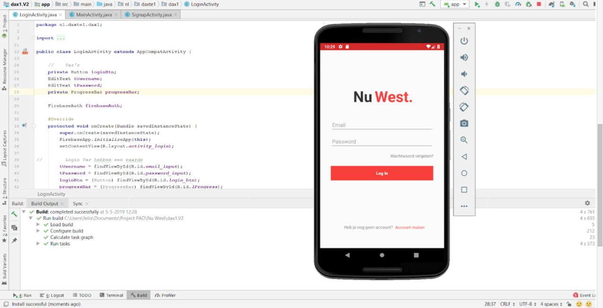

In this project I gained experience with AndriodStudio and associated technologies, including [Firebase](https://firebase.google.com) for database storage and Java for client programming. Every page consist with a new activity.

During the semester it was required to build an mobile application that would help the city council get closer to the youth.
My team and I can with an idea to make a social media app. The city council can post information which is relevant for the youth. Posts could be made in different layout: a survey, events or announcements. 
The city council will recieve this data from the user and will be able to interact with the youth.

The youth can make their own posts aswell. These post could be "shared content" or messages the user wants to share. 
Every user has a profile with an image. All data is stored in the cloud with Firebase. Firebase provides an authentication via mail which we used.
Passwords are encrypted and stored in Firebase.

 
Source: <a href="https://github.com/dkumankumah/nuwest"><i class="large github icon"></i>NuWest</a>
